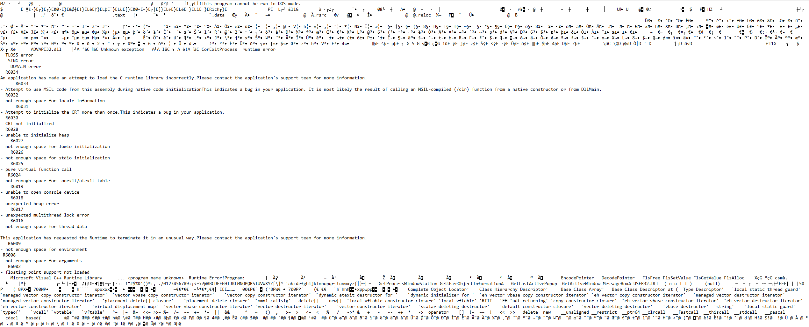

# PLAINTEXT BIN
Difficulty: intro

---

Every file is just a bunch of 1's and 0's that are interpreted differently depending on how they are processed.

Your League Of Legends launcher and saved text file are one of the same. One is executable code and one is plaintext information.

Open any .exe on your computer in notepad. 




```
Those sentences you can read, lets call them "strings" for now
```

WEIRD RIGHT? There may be a few readable sentences (strings) in there but nothing really makes sense. Different file types are made for different purposes, that .exe file is made to be run by a computer while the txt is made to be read by a human.

----

## CHALLENGE

---

### strings - picoctf 2018

This executable is leaking secure strings, find a way to dump the strings and search for something that starts with "picoCTF"

hint: What does the "strings" command in linux do?

hint: What does the "grep" command in linux do?

hint: What does "findstr" in windows do?


----